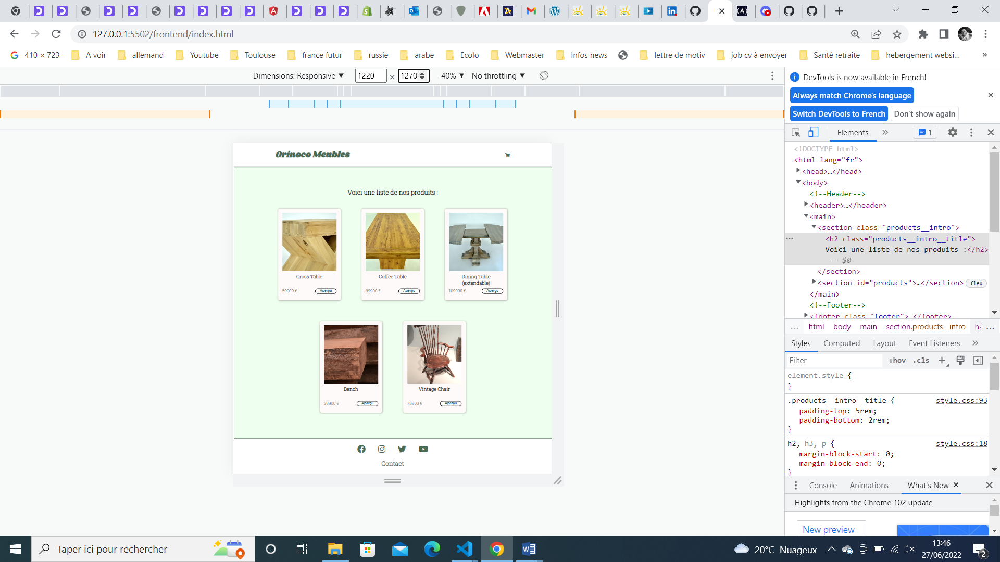
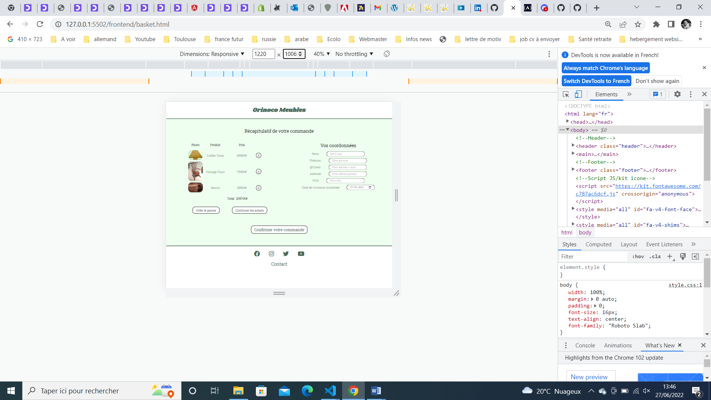

# Orinoco # Frontend development

Création d'un site e-commerce proposant des meubles en chêne

🛠️ Effectuer des requêtes avec une API

🛠️ Intégrer dynamiquement les éléments de l’API dans les différentes pages web avec JavaScript

🛠️ Planification de tests

| Langages | Outils |
| :---: | :---: |
| HTML5 | Node.js/NPM (Node Package Manager)|
| CSS3 | Git/GitHub |
| Java-script | Visual Studio Code |

Le site comporte 4 pages : 
    
*   Une page d’__Accueil__ montrant tous les articles disponibles à la vente.

*   Une page **Produit**, depuis cette page l’utilisateur peut sélectionner un vernis et ajouter le produit personnalisé à son panier.

*   Une page **Panier**, avec un résumé des produits dans le panier et le prix total du panier. Et également Un formulaire avec des données vérifées par regex permettant de passer une commande. 

* Une page **Confirmation** avec un message de confirmation de commande et indiquant l'identifiant de commande envoyé par l’API.

<!-- <table>
<thead>
<tr>
<th align="center">Langages</th>
<th align="center">et</th>
<th align="center">outils</th>
</tr>
</thead>
<tbody>
<tr>
<td align="center">HTML5</td>
<td align="center">Node.js</td>
<td align="center">NPM (Node Package Manager)</td>
</tr>
<tr>
<td align="center">CSS3</td>
<td align="center">Git/GitHub</td>
<td align="center">xXx</td>
</tr>
<tr>
<td align="center">Java-script</td>
<td align="center">Sass</td>
<td align="center">Visual Studio Code</td>
</tr>
</tbody>
</table> -->

### Technologies utilisées : ###

HTML, CSS et Javascript.

### Prérequis ###

Vous aurez besoin de Node et `npm` installé localement sur votre machine.

### Installation ###

Clonez ce répo. Depuis le dossier du projet, tapez `npm install`. Vous pouvez démarrez le serveur avec la commande `node server`. 
Le serveur doit se trouver sur `localhost` avec le port par défaut `3000`. Si le serveur est sur un autre port, cela sera indiqué sur la console lorsque le serveur démarre, ex. : `Listening on port 3001`.

 &nbsp; 

  &nbsp; 

__1) Page d'accueil avant design final &nbsp;   &nbsp;  &nbsp; &nbsp; &nbsp; &nbsp;   &nbsp;   &nbsp;  &nbsp; &nbsp;  &nbsp; &nbsp;   &nbsp;   2) Panier avant design final__

 &nbsp; 

</img> </img>
